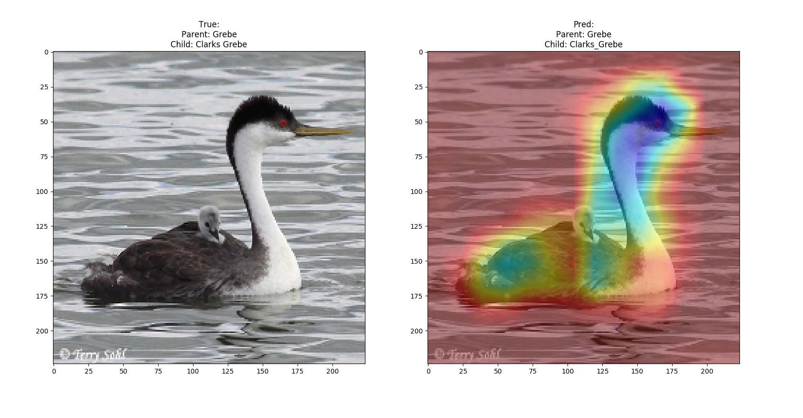
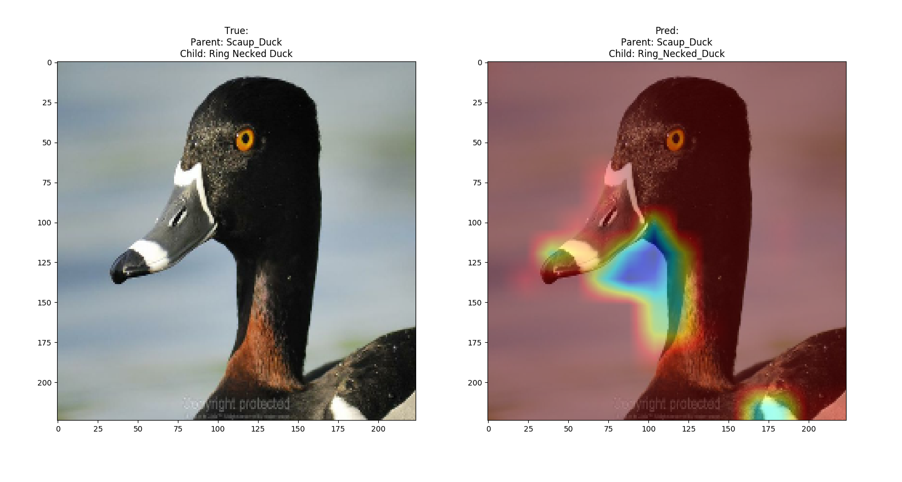
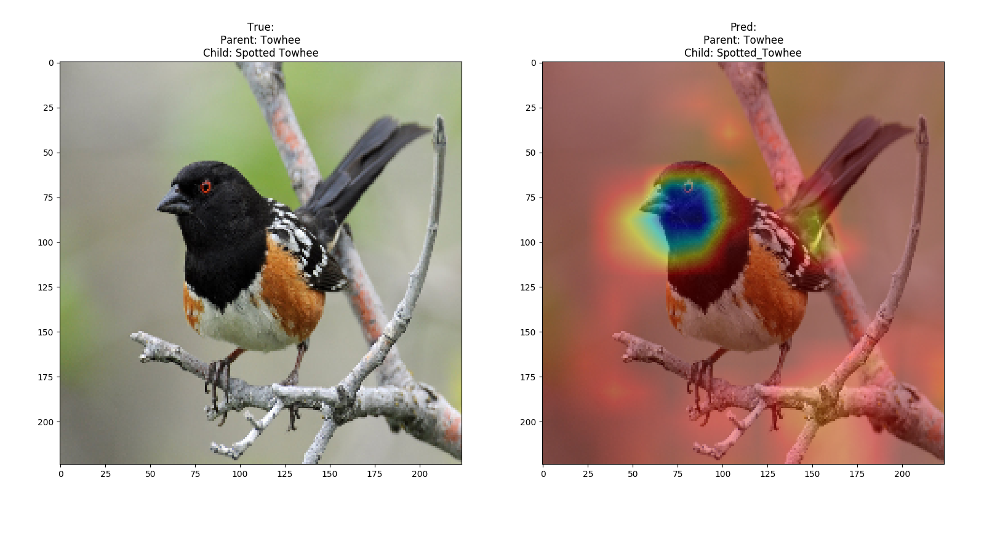
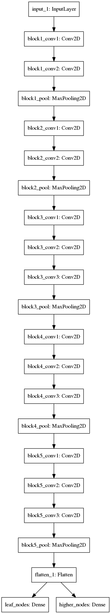

# Explainable AI Research:

## Introduction:
Welcome to my AI research project! This project attempts to answer two advanced machine learning questions:

    1. Can we train a machine learning model to recognize the hierarchy of bird families from images?
    2. Can we have the model explain the rational for the decision making process?

These are important questions with consequences to the real world. The topics covered in this project are: Multi-Task Learning and Explainable AI. 

### Technologies used:
Keras, Tensorflow (Backend), Scikit-Learn, Numpy, HTML, CSS, Javascript

## Accomplishments:
I've succeeded in training a machine learning model to recognize the hierarchy of birds and also produce the rational for the decision using a heatmap.

Below are a few examples:

Clark's Grebe

Ring Necked Duck

Spotted Towhee

Here's the model architecture:

